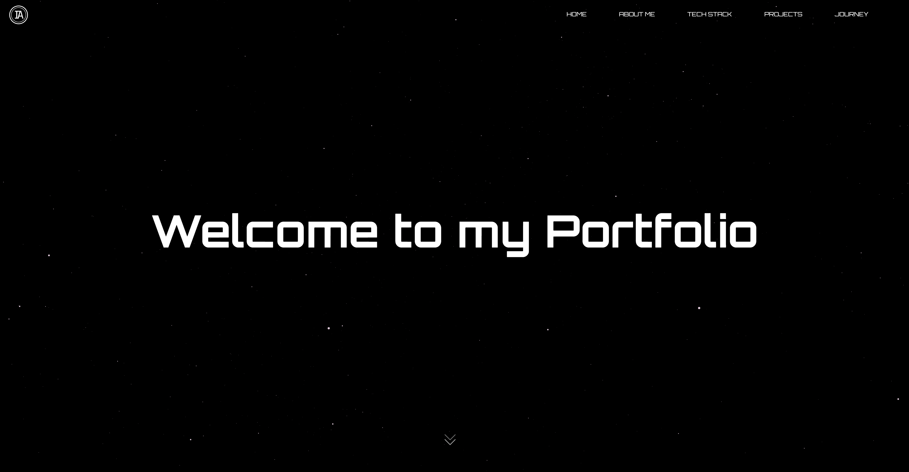
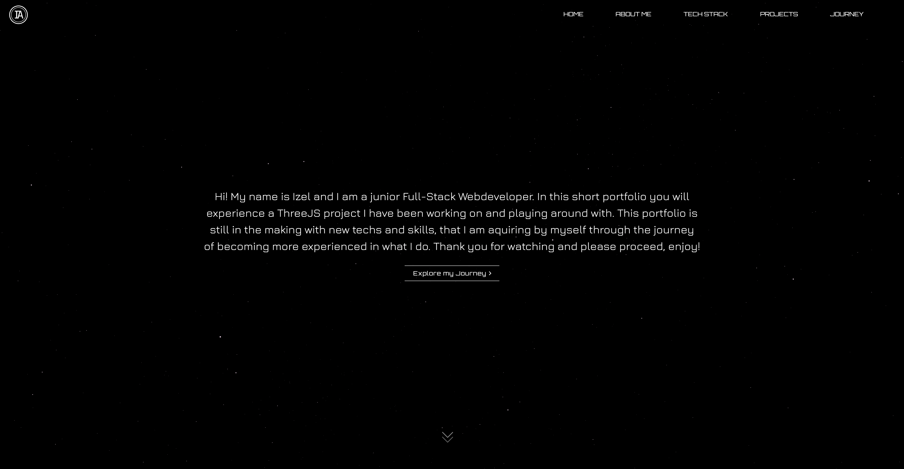
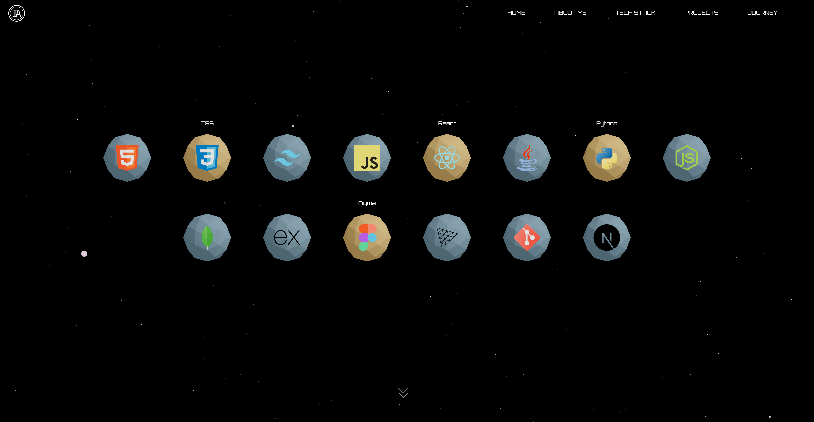
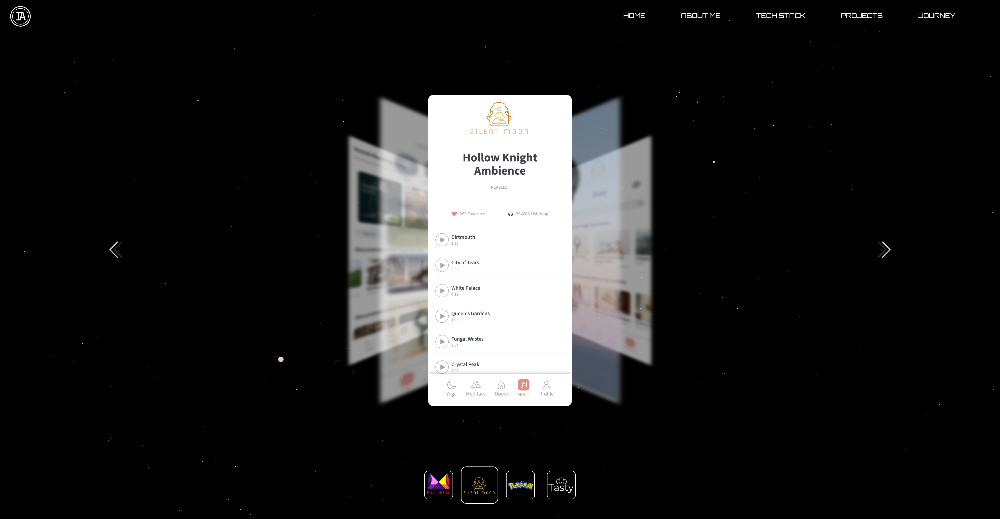
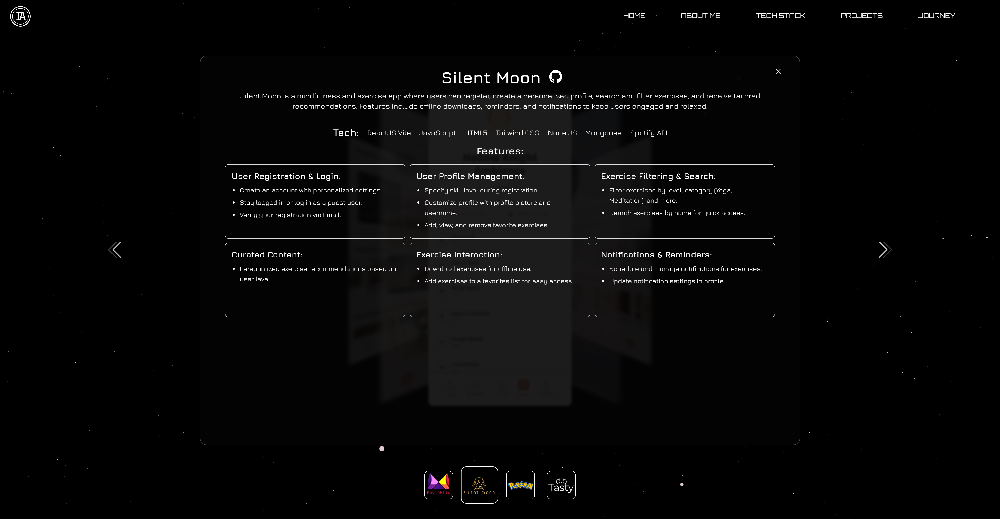
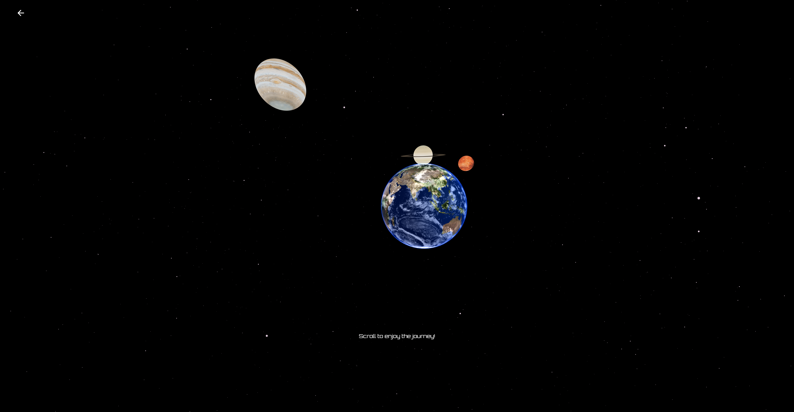

<h1 align="center"><samp>Portfolio</samp> </h1>

 
  
  
  

<h3><samp>Build with:</samp></h3>
<ul>
<li><samp>ReactJS Vite</samp></li>
<li><samp>JavaScript</samp></li>
<li><samp>HTML5</samp></li>
<li><samp>CSS</samp></li>
<li><samp>ThreeJS/Drei</samp></li>
</ul>

<samp>
  <h2>Portfolio Features</h2>
  <ul>
    <li>
      <strong>About Me</strong>
      <ul>
        <li>Little introduction about me.</li>   
        <li>3D Background with Stars.</li>
      </ul>
    </li>
    <li>
      <strong>Interactive Tech Stack</strong>
      <ul>
        <li>Explore technologies represented as 3D objects.</li>
        <li>Interact with elements for a playful experience.</li>
      </ul>
    </li>
    <li>
      <strong>Project Showcase</strong>
      <ul>
        <li>Slideshow with screenshots of past projects.</li>
        <li>Quick navigation between projects with smooth transitions.</li>
        <li>Each project highlights description, stack, and key features.</li>
      </ul>
    </li>
    <li>
      <strong>Journey Page</strong>
      <ul>
        <li>Built with Three.js/Drei for a 3D immersive experience.</li>
        <li>Navigate by scrolling through a space-themed environment with planets.</li>
      </ul>
    </li>
  </ul>
</samp>

<h2><samp>Live site</samp></h2>
<li><samp><a href="https://portfolio.izel-acar.de" target="_blank" rel="noopener noreferrer">Live Page</a></samp></li>

<h2><samp>Screenshot</samp></h2>

